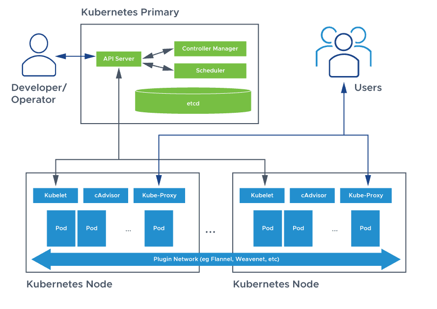

### architecture of Kubernetes (K8s) is designed to efficiently manage containerized applications across multiple nodes in a cluster, ensuring scalability, fault tolerance, and ease of deployment. The architecture is made up of a Control Plane and a Data Plane , each with specific components that work together to orchestrate the entire system
# Kubernetes Architecture - Complete Overview

Kubernetes (K8s) is a powerful open-source system for automating deployment, scaling, and management of containerized applications. This document provides a comprehensive overview of Kubernetes architecture, detailing the roles of each component and their use cases.

---

## 🚀 Overview of Kubernetes Architecture

Kubernetes follows a **master-worker (control plane - node)** architecture:

* **Control Plane (Master Node)**: Manages the entire cluster.
* **Worker Nodes (Minions)**: Run the application workloads (containers).

---

## 🧠 Control Plane Components (Master Node)

These components manage the state and operations of the cluster.

### 1. kube-apiserver

* **Role**: Frontend for the control plane.
* **Function**:

  * Exposes REST API.
  * Authenticates and validates requests.
  * Acts as the communication hub between all components.

### 2. etcd

* **Role**: Key-value distributed store.
* **Function**:

  * Stores all cluster data.
  * Maintains configuration, state, secrets, and metadata.

### 3. kube-scheduler

* **Role**: Pod scheduling.
* **Function**:

  * Watches for unassigned Pods.
  * Assigns Pods to suitable nodes based on resource availability, affinity, etc.

### 4. kube-controller-manager

* **Role**: Runs all controller logic.
* **Function**:

  * Node Controller: Manages node availability.
  * Replication Controller: Ensures desired number of Pods.
  * Endpoint Controller: Updates Endpoints for Services.
  * Job Controller: Manages batch Jobs.

### 5. cloud-controller-manager (Optional)

* **Role**: Integrates Kubernetes with cloud providers.
* **Function**:

  * Node management in cloud.
  * Manages cloud load balancers.
  * Handles persistent volumes and routes.

---

## ⚙️ Worker Node Components

Worker nodes run the actual application workloads.

### 1. kubelet

* **Role**: Node agent.
* **Function**:

  * Registers the node with the cluster.
  * Ensures containers in Pods are running correctly.
  * Communicates with the API server.

### 2. kube-proxy

* **Role**: Network proxy.
* **Function**:

  * Maintains network rules for communication.
  * Forwards traffic to appropriate Pods.
  * Uses iptables or IPVS for service load balancing.

### 3. Container Runtime

* **Role**: Runs containers.
* **Function**:

  * Pulls container images.
  * Starts/stops containers.
  * Examples: containerd, CRI-O (Docker is deprecated).

---

## 📦 Pod - The Basic Deployable Unit

* A Pod can hold one or more containers.
* Containers share network, storage, and a specification.
* Multiple containers in a Pod usually work together.

---

## 🎯 Use Cases Summary

| Component                | Use Case Example                                     |
| ------------------------ | ---------------------------------------------------- |
| kube-apiserver           | Accepting user requests and relaying to the cluster. |
| etcd                     | Storing current state of the cluster.                |
| kube-scheduler           | Assigning workloads to the most appropriate nodes.   |
| kube-controller-manager  | Ensuring the desired state (e.g., 3 replicas).       |
| cloud-controller-manager | Creating cloud load balancers for Services.          |
| kubelet                  | Running and monitoring containers on a node.         |
| kube-proxy               | Managing traffic routing to Services and Pods.       |
| Container Runtime        | Pulling images and running containers.               |

---

## 🔁 Cluster Operation Flow

1. User submits a deployment via `kubectl`.
2. `kube-apiserver` receives the request and stores it in `etcd`.
3. `kube-controller-manager` detects the desired state.
4. `kube-scheduler` places the Pod on the best available node.
5. `kubelet` on the node pulls the image and runs the Pod.
6. `kube-proxy` ensures service networking and routing.

---

## 🖼️ Text Diagram Summary

```
Control Plane:
+------------------------------+
|        kube-apiserver       |
|        etcd (DB)            |
|        kube-scheduler       |
|  kube-controller-manager    |
+------------------------------+

Worker Node:
+----------------------------+
| kubelet                   |
| kube-proxy                |
| container runtime         |
| [Pod] -> [Container]      |
+----------------------------+
```
```
[ kube-apiserver ]   <-- control plane
        ↓
     (sends PodSpec)
        ↓
[ kubelet ]           <-- runs on each node
        ↓ (via CRI)
[ containerd ]
        ↓
[ runc ]
        ↓
[ Linux Kernel → Container ]

---

[ You (kubectl) ]
        ↓
[ kube-apiserver ]
        ↓
[ kubelet (on node) ]
        ↓
[ containerd ]
        ↓
[ runc → Linux kernel → container runs ]


🔁 Step-by-step flow:
1. User → kube-apiserver
kubectl sends the pod YAML to the kube-apiserver

Example: "I want to run an Nginx pod"

2. kube-apiserver → etcd
The kube-apiserver stores this pod info in the etcd database

3. kube-apiserver → kubelet
It then tells the kubelet (on the correct node)
"Hey, this pod needs to be created."

4. kubelet → containerd
The kubelet reads the pod spec, pulls the image, and tells containerd to start the container

5. containerd → runc → Linux kernel
containerd uses runc to actually create and start the container using the host's Linux kernel features
```
---

## 📘 Conclusion

Kubernetes provides a highly modular and scalable way to manage containerized applications. Understanding the architecture helps DevOps engineers, developers, and administrators design robust and scalable solutions.

Let us know if you want a visual diagram or YAML deployment examples!




  ```
  You (user)
  ↓
Docker CLI
  ↓
Docker Engine (dockerd)
  ↓
Container Runtime (like containerd → runc)
  ↓
Linux Kernel Features (namespaces, cgroups, etc.)

------
You (kubectl apply)
   ↓
Kube API Server
   ↓
Kubelet (on each node)
   ↓
Container Runtime (like containerd → runc)
   ↓
Linux Kernel (namespaces, cgroups)

```
